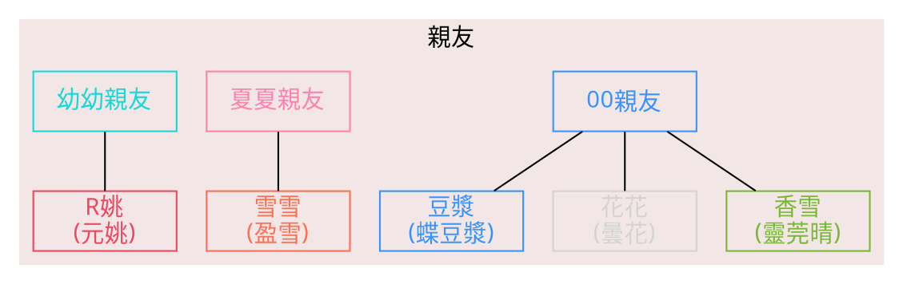
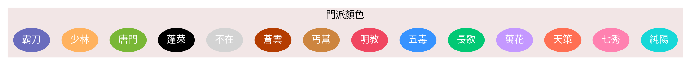

```dot
digraph{
    subgraph cluster{
    color="#F2E6E6";
    style=filled;
    node[fontname="微軟正黑體",shape=box,fixedsize=true,width=1.2];
    {node [fixedsize=true];"暱稱\n(ID)"}
    {node [color="#FF81B0",fontcolor="#FF81B0"];"帥氣的小姐姐\n(葬雪調)";}
    {node [color="#F04660",fontcolor="#F04660"];"大貓咪\n(梵森)";}
    {node [color="#02C874",fontcolor="#02C874"];"R靈\n(鉑靈)";}
    {node [color="#02C874",fontcolor="#02C874"];"塵塵\n(沐塵緣)";}
    {node [color="#16D8D8",fontcolor="#16D8D8"];"羊肉爐\n(墨曲紫濤)";};
    {node [color="#6A6CBD",fontcolor="#6A6CBD"];"小九\n(柳朔方)";};
    {node [color="#3793FF",fontcolor="#3793FF"];"淺淺\n(萸淺)";}
    {node [color="#F04660",fontcolor="#F04660"];"白白\n(阡月)";}
    {node[color="lightgray",fontcolor="lightgray"];"小易\n(月玲花)";};
    {node [color="#16D8D8",fontcolor="#16D8D8"];"R涼\n(涼宸)";};
    {node [color="#CD853F",fontcolor="#CD853F"];"清清\n(霽瑤)";};
    {node [color="#16D8D8",fontcolor="#16D8D8"];"幼幼\n(幼刀)";};
    {node [color="#C498FF",fontcolor="#C498FF"];"阿皮\n(皮醬)";};
    {node [color="#3793FF",fontcolor="#3793FF"];"00\n(雲紫靈)";}
    {node [color="black",fontcolor="black"];"小天\n(傲凌雲濤)";}
    {node [color="lightgray",fontcolor="lightgray"];"小貓貓\n(貓尾蝶)";}//霸刀
    {node [color="#3793FF",fontcolor="#3793FF"];"緋緋\n(璃惑)";}
    {node [color="#FF81B0",fontcolor="#FF81B0"];"夏夏\n(芸夏)";};
    {node [color="#FF6F53",fontcolor="#FF6F53"];"皓呆\n(皓白)"};
    {node [color="#B43C00",fontcolor="#B43C00"];"阿夜\n(長孫雪夜)";};
    {node [color="#FF81B0",fontcolor="#FF81B0"];"梨子\n(蘇沐)";}
    {node [color="#B43C00",fontcolor="#B43C00"];"小開水\n(板木老大)";}
    {node [color="#02C874",fontcolor="#02C874"];"柳柳\n(薄柳)";}
    {node [color="#FF6F53",fontcolor="#FF6F53"];"雪雪\n(盈雪)";};
    {node [color="#FFB25F",fontcolor="#FFB25F"];"茗茗\n(柳墨卿)";};
    {node [color="#C498FF",fontcolor="#C498FF"];"丹丹\n(甯珞)";};
    {node [color="#FF81B0",fontcolor="#FF81B0"];"溪溪\n(雨落成溪)";};
    {node [color="black",fontcolor="black"];"鹿鹿\n(童鹿)";};
    {node [color="black",fontcolor="black"];"仟仟\n(上雨知弦)";};
    {node [color="black",fontcolor="black"];"小貳";};
    {node [color="black",fontcolor="black"];"73\n(青衫不改去年)";};
    {node [color="#F04660",fontcolor="#F04660"];"夜曄空\n(夜曄)";};
    "大貓咪\n(梵森)"->{"R靈\n(鉑靈)","阿皮\n(皮醬)","雪雪\n(盈雪)","小易\n(月玲花)","夏夏\n(芸夏)","塵塵\n(沐塵緣)","淺淺\n(萸淺)","皓呆\n(皓白)"}
    "帥氣的小姐姐\n(葬雪調)"->{"大貓咪\n(梵森)","73\n(青衫不改去年)"}
    "塵塵\n(沐塵緣)"->{"羊肉爐\n(墨曲紫濤)","小九\n(柳朔方)"}
    "白白\n(阡月)"->{"小開水\n(板木老大)"}
    "淺淺\n(萸淺)"->{"小開水\n(板木老大)","鹿鹿\n(童鹿)","柳柳\n(薄柳)"}
    "小易\n(月玲花)"->{"R涼\n(涼宸)","清清\n(霽瑤)","幼幼\n(幼刀)"}
    "梨子\n(蘇沐)"->{"R涼\n(涼宸)","阿夜\n(長孫雪夜)"}
    "阿皮\n(皮醬)"->{"00\n(雲紫靈)","柳柳\n(薄柳)","茗茗\n(璇禾)","丹丹\n(甯珞)"}
    "00\n(雲紫靈)"->{"小天\n(傲凌雲濤)","小貓貓\n(貓尾蝶)"}
    "R靈\n(鉑靈)"->{"緋緋\n(璃惑)","柳柳\n(薄柳)","茗茗\n(璇禾)"}
    "緋緋\n(璃惑)"->{"夜曄空\n(夜曄)"}
    "夏夏\n(芸夏)"->{"溪溪\n(雨落成溪)"}
    "清清\n(霽瑤)"->{"仟仟\n(上雨知弦)"}
    "小開水\n(板木老大)"->{"小貳"}
    label="神木教師徒關係表"
    }
}
```

```dot
graph{
    subgraph cluster{
    label="親友";
    color="#F2E6E6";
    style=filled;
    node[fontname="微軟正黑體",shape=box,fixedsize=true,width=1.2];
    {node [color="#3793FF",fontcolor="#3793FF"]"00親友";}
    {node [color="#FF81B0",fontcolor="#FF81B0"]"夏夏親友";}
    {node [color="#16D8D8",fontcolor="#16D8D8"];"幼幼親友";};
    {node [color="#F04660",fontcolor="#F04660"]"R姚\n(元姚)";};
    {node [color="#FF6F53",fontcolor="#FF6F53"];"雪雪\n(盈雪)";};
    {node [color="#3793FF",fontcolor="#3793FF"];"豆漿\n(蝶豆漿)";};
    {node [color="lightgray",fontcolor="lightgray"];"花花\n(曇花)"};//七秀#FF81B0
    {node [color="#79B736",fontcolor="#79B736"];"香雪\n(靈莞晴)"};
    "夏夏親友"--"雪雪\n(盈雪)";
    "幼幼親友"--"R姚\n(元姚)";
    "00親友" -- "花花\n(曇花)";
    "00親友" -- "香雪\n(靈莞晴)";
    "00親友" -- "豆漿\n(蝶豆漿)";
    }
}
```

```dot
graph{
    subgraph cluster{
    label="門派顏色";
    color="#F2E6E6";
    style=filled;
    node [style=solid,style=filled,fontname="微軟正黑體",fixedsize=true,fontcolor=white];
    {node[color="#16D8D8"];純陽;};
    {node[color="#FF81B0"];七秀;};
    {node[color="#FF6F53"];天策;};
    {node[color="#C498FF"];萬花;};
    {node[color="#02C874"];長歌;};
    {node[color="#3793FF"];五毒;};
    {node[color="#F04660"];明教;};
    {node[color="#CD853F"];丐幫;};
    {node[color="#B43C00"];蒼雲;};
    {node[color="lightgray"];不在;};
    {node[color="black"];蓬萊;};
    {node[color="#79B736"];唐門;};
    {node[color="#FFB25F"];少林;};
    {node[color="#6A6CBD"];霸刀;};
    }
}
```